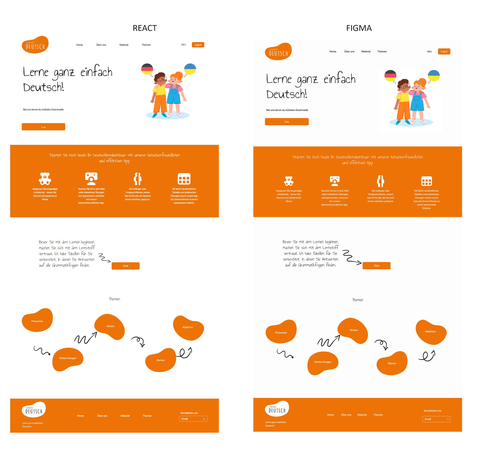

# Deutsch Lernen App

Dieses Projekt demonstriert meine umfassende Kompetenz in angewandten Technologien sowie meine Fähigkeit, sie erfolgreich einzusetzen. Die erworbenen Kenntnisse sind vielseitig einsetzbar und können problemlos in zukünftigen Projekten angewendet werden.

## Technologie:
- Figma
- React.ts
- Spring MVC
- MongoDB
- Lombok & Devtools


# **_V1.1.1_** : Figma - `HomePage`- DB 

### home page
Diese Version enthält die Umsetzung eines Designs aus Figma in eine React.ts-Anwendung. Das Projektbild aus Figma wurde als Ausgangspunkt genommen, um die Benutzeroberfläche mithilfe von React.ts zu entwickeln. Es umfasst die Umsetzung der Hauptseite und legt den Grundstein für weitere Funktionen und Seiten innerhalb der Anwendung.

Um das Figma-Bild anzusehen, klicke [hier](images/v1.0.1/Main_page_DEU.jpg).



### VerbEntity

Weiter wurde ein VerbEntity-Controller/Service hinzugefügt, um die Datenbankfunktionalität in die Anwendung zu integrieren. Der Controller ist dafür verantwortlich, HTTP-Anfragen zu empfangen und sie an den entsprechenden Service weiterzuleiten, der dann die erforderlichen Datenbankoperationen für die VerbEntity ausführt. Der Service übernimmt die Geschäftslogik und die Interaktion mit der MongoDB-Datenbank, um Daten für die VerbEntity abzurufen, zu speichern, zu aktualisieren oder zu löschen.  Durch die Integration dieser Komponenten wird die Anwendung in der Lage sein, effektiv mit der Datenbank zu kommunizieren und die Daten für die VerbEntity zu verwalten, was für die VerbPage von entscheidender Bedeutung ist.

Um einen MongoDB-Container mit Docker zu erstellen, kannst du den folgenden Befehl verwenden:
```
docker run --name german-learning-db -p 27017:27017 mongo:7
```

# **_V1.1.2_** : Figma - `VerbsPage` - DB 

### verbs page

VerbsPage wurde von Figma implementiert, wo das Design und die Benutzeroberfläche für die Anzeige und Interaktion mit Verben erstellt wurden.


